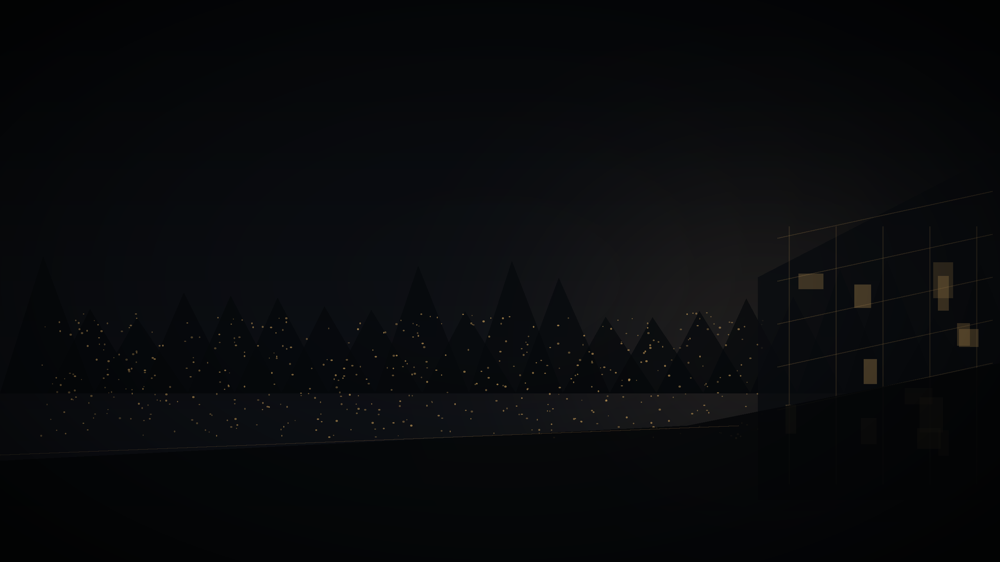
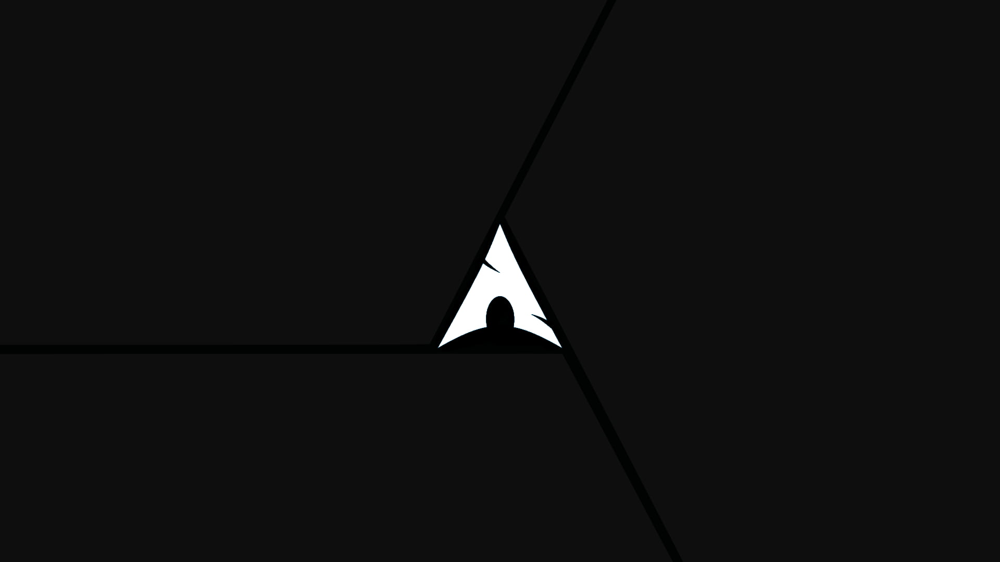
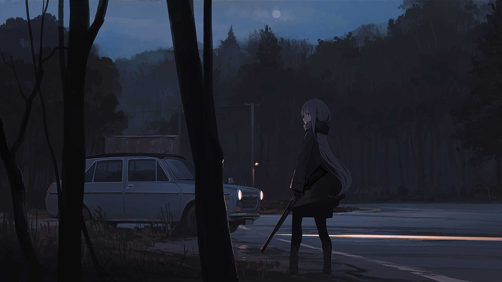
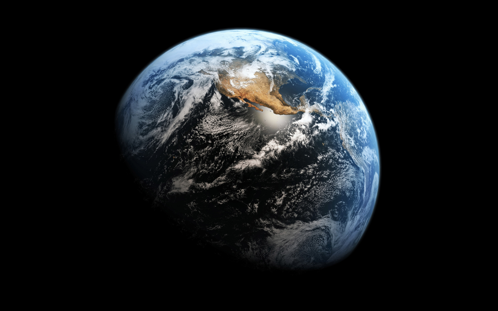
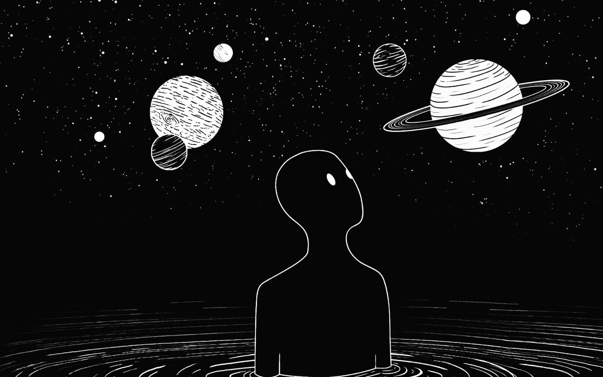
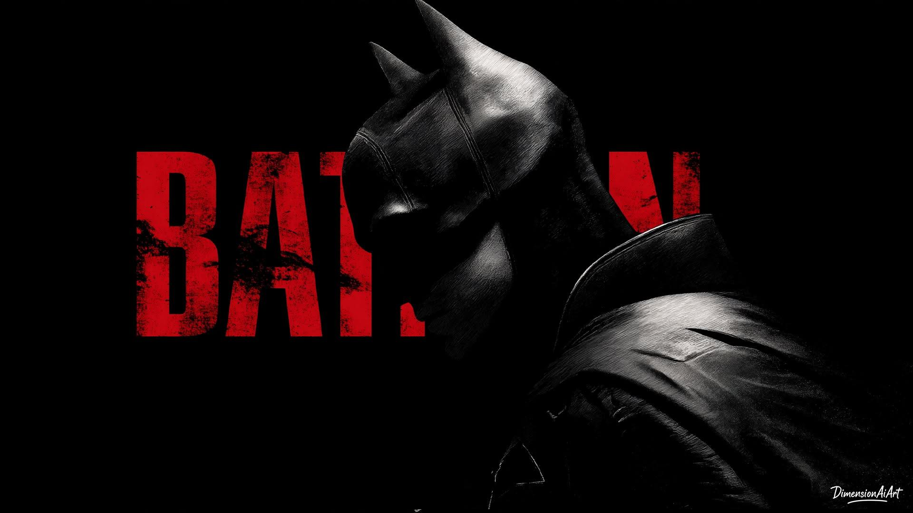
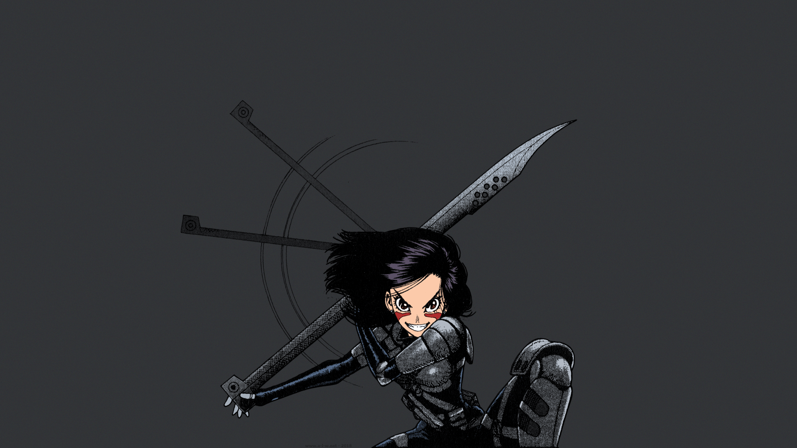

# Wallpaper Collection

A curated collection of dark, cinematic wallpapers for desktops, laptops, and any setup that appreciates a quiet screen with a little atmosphere.

The collection moves between dark cityscapes, deep space, anime night scenes, abstract color, machines, landscapes, and minimal marks. Most images are chosen to leave enough visual breathing room for bars, terminals, launchers, and readable windows.

## Gallery

### Featured

<table>
<tr>
<td width="50%"></td>
<td width="50%"></td>
</tr>
<tr>
<td width="50%"></td>
<td width="50%"></td>
</tr>
</table>

### Space and Abstract

<table>
<tr>
<td width="50%"></td>
<td width="50%"></td>
</tr>
<tr>
<td width="50%"></td>
<td width="50%"></td>
</tr>
</table>

### Characters and Machines

<table>
<tr>
<td width="50%"></td>
<td width="50%"></td>
</tr>
<tr>
<td width="50%"></td>
<td width="50%"></td>
</tr>
</table>
