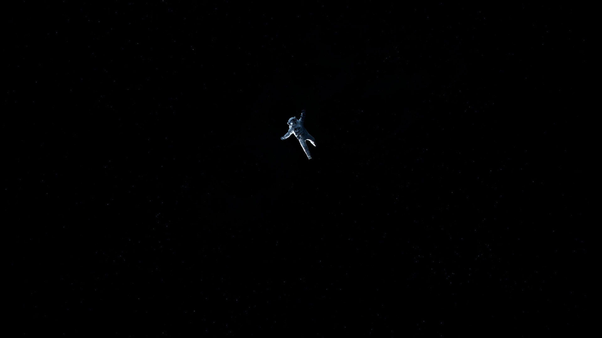
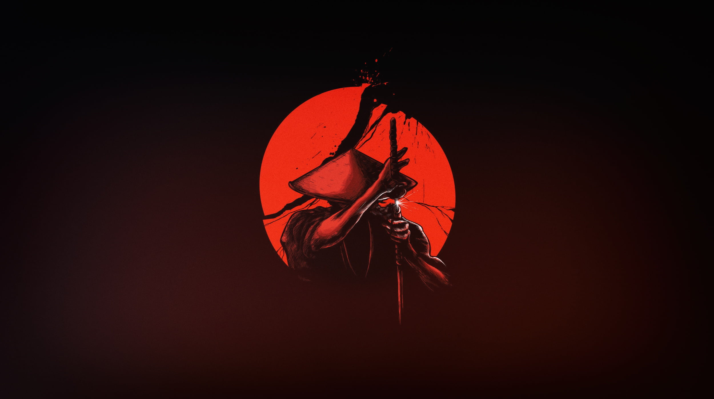
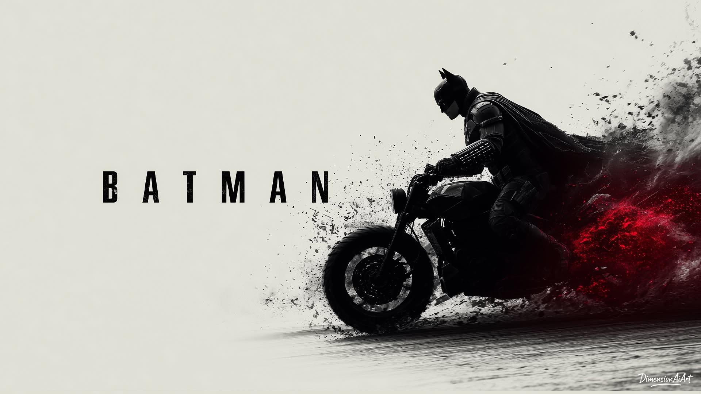
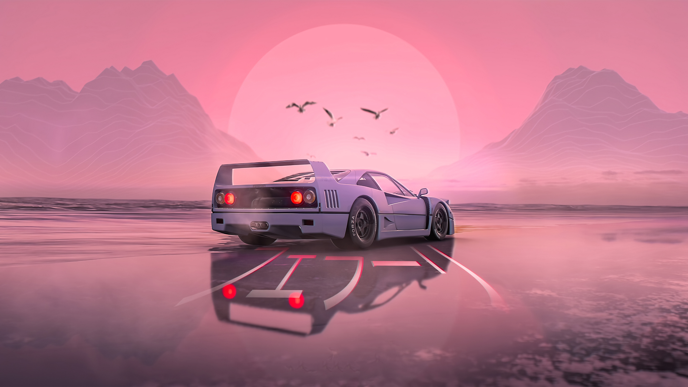
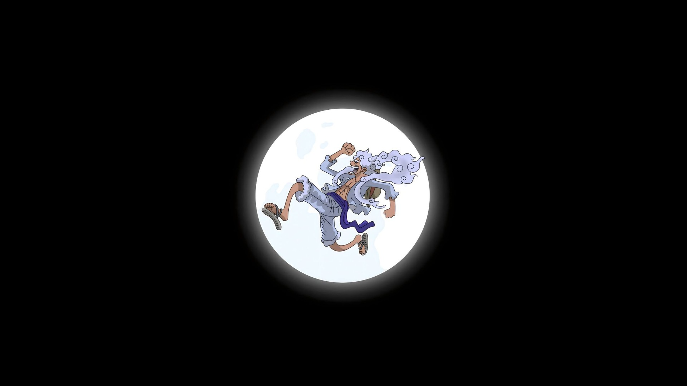

# Noir Signal Wallpapers

A curated collection of dark, cinematic wallpapers for Linux desktops, Hyprland, and any setup that appreciates a quiet screen with a little atmosphere.

The collection moves between noir cityscapes, deep space, anime night scenes, abstract color, machines, landscapes, and minimal marks. Most images are chosen to leave enough visual breathing room for bars, terminals, launchers, and readable windows.

## Gallery

### Noir Signal

<table>
<tr>
<td width="50%"></td>
<td width="50%"></td>
</tr>
<tr>
<td width="50%"></td>
<td width="50%"></td>
</tr>
</table>

### Space and Abstract

<table>
<tr>
<td width="50%"></td>
<td width="50%"></td>
</tr>
<tr>
<td width="50%"></td>
<td width="50%"></td>
</tr>
</table>

### Characters and Machines

<table>
<tr>
<td width="50%"></td>
<td width="50%"></td>
</tr>
<tr>
<td width="50%"></td>
<td width="50%"></td>
</tr>
</table>

## Collection

- Dark and cinematic compositions for focused work
- Wide desktop wallpapers, primarily 16:9 and ultrawide-friendly
- JPG and PNG formats
- Descriptive filenames for easy searching and scripting
- Exact duplicate files removed from the collection
- Compatible with `awww`, `swww`, `hyprpaper`, `feh`, and desktop wallpaper pickers

## Use With Noir Signal

Copy the collection into the wallpaper directory used by Noir Signal:

```bash
mkdir -p ~/Pictures/wallpaper
cp -- *.jpg *.jpeg *.png *.webp ~/Pictures/wallpaper/
```

The Noir Signal wallpaper picker looks in:

```text
~/Pictures/wallpaper
```

It supports these formats:

```text
.jpg  .jpeg  .png  .webp
```

Change the wallpaper with the picker:

```bash
~/.config/hypr/scripts/wallpaper-picker
```

Choose a random wallpaper directly:

```bash
~/.config/hypr/scripts/wallpaper-picker --random
```

When used with the Noir Signal desktop, changing the wallpaper also regenerates the Matugen palette for Hyprland, Waybar, Kitty, Rofi, and Hyprlock.

## Browse Locally

List the collection by name:

```bash
find ~/Pictures/wallpaper -maxdepth 1 -type f \
  \( -iname '*.jpg' -o -iname '*.jpeg' -o -iname '*.png' -o -iname '*.webp' \) \
  -printf '%f\n' | sort
```

Find large files before copying the collection to another machine:

```bash
find ~/Pictures/wallpaper -maxdepth 1 -type f -printf '%s %f\n' \
  | sort -nr | numfmt --field=1 --to=iec
```

## Naming

New wallpapers should use short, descriptive, lowercase names with hyphens:

```text
rainy-neon-alley.jpg
quiet-mountain-night.png
amber-orbit.webp
```

Avoid spaces, numbers-only names, and duplicate copies. Descriptive names make the Rofi picker easier to use and make shell scripts more reliable.

## Contributing

1. Add a wallpaper in JPG, JPEG, PNG, or WebP format.
2. Give it a descriptive lowercase filename.
3. Check that it opens correctly and works at desktop resolution.
4. Remove exact duplicates before submitting a change.
5. Add a short note in the pull request when attribution is known or required.

Please do not add images that you do not have permission to redistribute. When the source or creator is known, keep that information in the commit message or a separate attribution note.

## License and Attribution

This repository is a personal wallpaper collection. Image rights and licenses may differ by file. Do not assume that every image is free to redistribute or use commercially. Verify the source and licensing terms of an image before sharing it outside personal use.

The repository layout, README, and collection tooling are maintained for the Noir Signal desktop setup.
